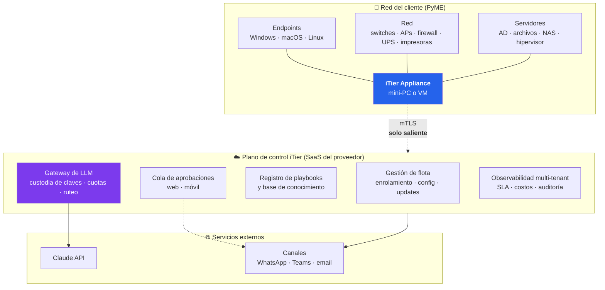
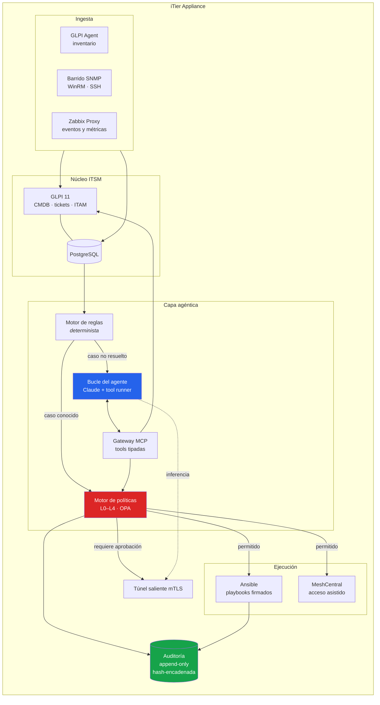
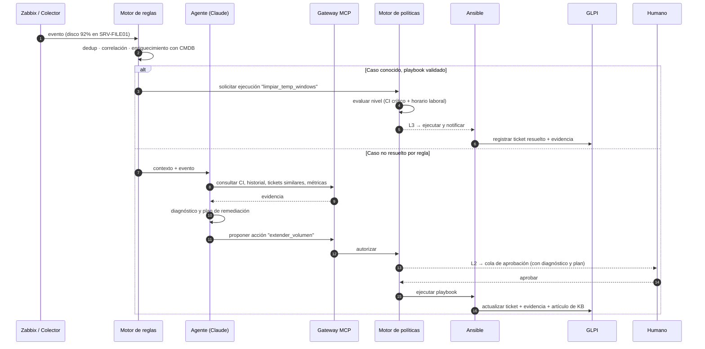
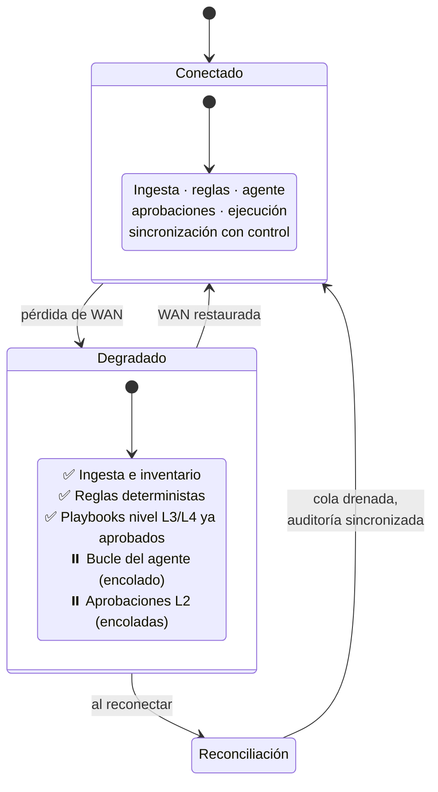

# 02 · Arquitectura

## Principios de diseño

1. **El borde recolecta y ejecuta; la nube razona.** El appliance no corre un LLM.
2. **Nada entra.** El appliance solo abre conexiones salientes. Cero puertos expuestos.
3. **El modelo nunca ejecuta código libre.** Toda acción pasa por una tool MCP tipada
   que invoca un playbook versionado.
4. **La autonomía se gana, no se asume.** Toda acción arranca en "recomendar" y
   promueve por evidencia.
5. **Determinista primero, LLM después.** Si una regla resuelve el caso, la regla gana:
   es más barata, más rápida y auditable.
6. **Degradación limpia.** Sin WAN, el appliance sigue recolectando, sigue ejecutando
   remediaciones pre-aprobadas por regla, y encola lo que requiera razonamiento.

---

## Vista de contexto

---

## Los tres planos

### Plano 1 — Borde (dentro del cliente)

| Componente | Función | Tecnología |
|---|---|---|
| **Colectores** | Inventario de hardware/software, descubrimiento SNMP de red, inventario remoto sin agente | GLPI Agent |
| **Eventos** | Métricas, umbrales, disponibilidad, low-level discovery | Zabbix Proxy |
| **CMDB / ITSM** | Elementos de configuración y sus relaciones, tickets, catálogo, contratos y garantías | GLPI 11 + PostgreSQL |
| **Motor de reglas** | Primera línea determinista: correlación de eventos, deduplicación, supresión de ruido, disparo de playbooks conocidos | Reglas declarativas (YAML) |
| **Bucle del agente** | Diagnóstico, correlación multi-sistema, planificación de remediación, redacción de tickets y comunicaciones | Anthropic SDK, tool runner |
| **Motor de políticas** | Decide `permitir` / `aprobar` / `denegar` por acción, CI, criticidad y ventana horaria | OPA (Rego) o rulebook tipado |
| **Gateway MCP** | Única superficie de capacidades del agente. Toda tool declara su clase de permiso | Servidores MCP locales |
| **Ejecución** | Remediación idempotente y reversible | Ansible; playbooks firmados |
| **Auditoría** | Registro inmutable de cada decisión, evidencia consultada y acción ejecutada | Log append-only con encadenamiento de hash |

### Plano 2 — Control (SaaS del proveedor)

| Servicio | Función |
|---|---|
| **Gestión de flota** | Enrolamiento de appliances, distribución de configuración y actualizaciones firmadas, salud de la flota |
| **Cola de aprobaciones** | Human-in-the-loop. Toda acción en nivel L2 espera acá; notificación push/WhatsApp con contexto suficiente para decidir sin abrir la consola |
| **Registro de playbooks** | Catálogo curado y versionado. Los playbooks se firman en el control y se verifican en el borde |
| **Gateway de LLM** | Custodia de la clave de API, tope de gasto por tenant, ruteo de modelo, contabilidad de tokens, gestión de caché de prompts |
| **Observabilidad** | Paneles multi-tenant, cumplimiento de SLA, costo por cliente, tasa de automatización, tasa de rollback |

### Plano 3 — Razonamiento

Claude API vía el gateway del plano de control. **Ningún appliance guarda la clave de API.**

| Nivel | Modelo | Uso |
|---|---|---|
| Por defecto | `claude-opus-5` | Bucle principal: diagnóstico, planificación, análisis de causa raíz, evaluación de riesgo de cambio |
| Opt-in (fase 2) | `claude-sonnet-5` | Triage y clasificación de alto volumen, una vez medida la caída de calidad |
| Opt-in (fase 2) | `claude-haiku-4-5` | Resumen de logs, extracción estructurada, normalización de inventario |

> El ruteo por niveles es una optimización **explícita y opcional**, no un default.
> Ver [05 · Modelo de costos](05-modelo-de-costos.md) para el análisis de impacto.

---

## Flujo principal: de la señal a la resolución

**Nota clave:** el modelo nunca invoca a Ansible. Propone una acción por nombre a través
de una tool MCP; el motor de políticas —código determinista, fuera del LLM— es quien
decide y quien ejecuta.

---

## Superficie de herramientas (MCP)

Toda capacidad del agente es una tool MCP con una **clase de permiso** declarada.
El agente no tiene acceso a shell, ni a la base de datos, ni a la red directamente.

### Clase `read` — sin efectos secundarios, siempre permitida

| Tool | Devuelve |
|---|---|
| `cmdb.get_ci` | Un elemento de configuración con sus atributos y relaciones |
| `cmdb.search_cis` | Búsqueda de CIs por tipo, ubicación, criticidad, etiqueta |
| `cmdb.get_impact_graph` | Grafo de dependencias aguas arriba/abajo de un CI |
| `tickets.search` | Tickets por estado, CI, categoría, texto |
| `tickets.get_similar` | Incidentes históricos parecidos, con su resolución |
| `metrics.query` | Serie temporal de una métrica para un CI y ventana |
| `logs.tail` | Últimas N líneas de un log declarado (allowlist de rutas) |
| `assets.get_lifecycle` | Garantía, contrato, fin de soporte, licencias del activo |
| `kb.search` | Base de conocimiento y errores conocidos |

### Clase `write_itsm` — escribe en el ITSM, nunca toca infraestructura

| Tool | Efecto |
|---|---|
| `tickets.create` · `tickets.update` · `tickets.resolve` | Ciclo de vida del ticket |
| `kb.propose_article` | Propone artículo de KB (requiere revisión humana para publicar) |
| `cmdb.propose_ci_change` | Propone corrección de dato de CMDB |
| `change.create_request` | Abre un RFC con análisis de riesgo adjunto |

### Clase `act` — toca la infraestructura, siempre pasa por políticas

| Tool | Efecto |
|---|---|
| `remediate.run_playbook` | Ejecuta un playbook del catálogo firmado, por nombre y parámetros tipados |
| `remediate.dry_run` | Ejecuta el playbook en modo check de Ansible; **siempre permitida** |
| `remediate.rollback` | Revierte la última ejecución de un playbook reversible |
| `access.request_remote_session` | Abre sesión de MeshCentral con testigo humano obligatorio |

### Clase `notify`

| Tool | Efecto |
|---|---|
| `notify.user` · `notify.oncall` · `notify.escalate` | Comunicación con contexto |

**Regla de oro:** no existe `run_shell`, no existe `execute_sql`, no existe `http_request`
genérico. Agregar una capacidad significa agregar una tool tipada, revisada y con clase
de permiso — nunca ampliar el alcance de una existente.

---

## Perfiles de hardware

| Perfil | Hardware | Corre | Cuándo |
|---|---|---|---|
| **Sonda** | Raspberry Pi 5, 4–8 GB | GLPI Agent + Zabbix Proxy + túnel. **Sin ITSM local** | Sucursal o sitio remoto que reporta al appliance de la casa central |
| **Appliance estándar** ⭐ | Mini-PC x86 (N100/N150), 16 GB RAM, NVMe 256 GB. ~USD 150–250 | Stack completo | Caso por defecto: 10–150 dispositivos |
| **Virtual** | VM 4 vCPU / 8–16 GB / 100 GB en Proxmox, Hyper-V, VMware o nube del cliente | Stack completo | Cliente con virtualización propia |
| **Grande** | Mini-PC i5/Ryzen, 32 GB, NVMe 512 GB | Stack completo + retención larga | 150–250+ dispositivos |

**Por qué la Pi no es el appliance estándar:** el stack completo (GLPI + PostgreSQL +
Zabbix + colectores + agente) necesita más RAM e I/O de lo que la Pi ofrece cómodamente,
y el ecosistema Docker ARM64 tiene huecos en imágenes de terceros que un x86 no tiene.
Un mini-PC N100 cuesta lo mismo o poco más, consume ~10 W y elimina toda esa clase de
problema. Ver [ADR-0007](adr/ADR-0007-perfiles-de-hardware.md).

---

## Conectividad y degradación

- **Solo saliente.** El appliance mantiene un túnel mTLS saliente hacia el plano de
  control. No hay puertos entrantes, no hay port-forwarding, no hay VPN que gestionar.
- **Identidad del appliance.** Certificado de cliente emitido en el enrolamiento,
  rotación automática, revocación desde el plano de control.
- **La cola es durable.** Eventos, decisiones pendientes y auditoría se persisten
  localmente y se drenan al reconectar. Una caída de internet no pierde evidencia.

---

## Manejo de datos y privacidad

| Dato | Dónde vive | Sale del cliente |
|---|---|---|
| Inventario detallado, CMDB, relaciones | Appliance | ❌ Nunca completo |
| Logs crudos, capturas, contenido de archivos | Appliance | ❌ Nunca |
| Métricas y series temporales | Appliance (agregados al control) | Parcial, agregado |
| Contexto enviado al LLM | Transitorio | ✅ Redactado y minimizado |
| Tickets y KB | Appliance; réplica de metadatos en control | Parcial |
| Auditoría | Appliance + control | ✅ Duplicado |

**Antes de cada llamada al LLM** se aplica una capa de minimización:
redacción determinista de PII y secretos (regex + Presidio), sustitución de nombres de
host y usuario por identificadores estables por tenant, y recorte al contexto
estrictamente necesario para la decisión. La correspondencia identificador↔real vive
solo en el appliance.

---

## Elección de la superficie de la API de Claude

El bucle del agente usa el **tool runner del SDK de Anthropic**
(`client.beta.messages.tool_runner`), no Managed Agents ni el Claude Agent SDK:

| Opción | Por qué se descartó / eligió |
|---|---|
| Bucle manual | Innecesario: los hooks por turno del tool runner cubren aprobación, intercepción, logging y reintentos |
| **Tool runner** ⭐ | **Elegida.** El SDK maneja el bucle; nosotros hospedamos el cómputo en el borde, que es el requisito duro |
| Managed Agents | Anthropic hospeda el bucle **y** un sandbox por sesión. Incompatible: las herramientas deben ejecutar dentro de la red del cliente |
| Claude Agent SDK | Es Claude Code como librería, con herramientas de filesystem/bash incorporadas. Exactamente la superficie que **no** queremos darle al agente |

Detalles de implementación en [`reference/edge-agent/`](../reference/edge-agent/).

---

## Decisiones relacionadas

- [ADR-0001 · GLPI como núcleo ITSM](adr/ADR-0001-nucleo-itsm-glpi.md)
- [ADR-0002 · Razonamiento fuera del borde](adr/ADR-0002-razonamiento-fuera-del-borde.md)
- [ADR-0003 · MCP como capa de herramientas](adr/ADR-0003-mcp-capa-de-herramientas.md)
- [ADR-0004 · Ansible para remediación](adr/ADR-0004-ansible-para-remediacion.md)
- [ADR-0005 · Conectividad solo saliente](adr/ADR-0005-conectividad-solo-saliente.md)
- [ADR-0006 · Niveles de autonomía graduada](adr/ADR-0006-autonomia-graduada.md)
- [ADR-0007 · Perfiles de hardware](adr/ADR-0007-perfiles-de-hardware.md)
