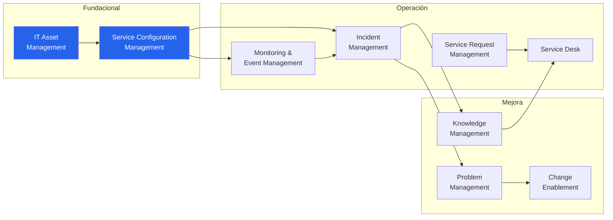
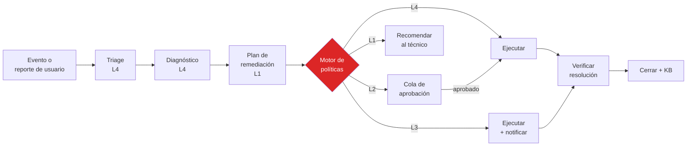

# 03 · Mapeo ITIL 4 → capacidades del agente

ITIL 4 define 34 prácticas de gestión. Una PyME no necesita 34 — necesita **9 bien
hechas**. Este documento las selecciona, define qué hace el agente en cada una, y en qué
nivel de autonomía arranca.

> Los niveles L0–L4 están definidos en [04 · Seguridad y autonomía](04-seguridad-y-autonomia.md).
> Resumen: **L0** observar · **L1** recomendar · **L2** aprobar-y-actuar ·
> **L3** actuar-y-notificar · **L4** autónomo.

---

## Prácticas en alcance

---

### 1 · IT Asset Management (ITAM)

*Planificar y gestionar el ciclo de vida completo de los activos de IT.*
Referencia normativa: **ISO/IEC 19770-1**.

| Qué hace el agente | Nivel inicial |
|---|---|
| Normalizar inventario crudo: reconciliar nombres de fabricante/modelo, deduplicar activos vistos por múltiples colectores | L3 |
| Detectar activos huérfanos: en la red pero sin dueño, sin contrato o sin garantía registrada | L1 |
| Alertar por fin de garantía, fin de soporte del fabricante y vencimiento de contratos, con ventana configurable | L3 |
| Reconciliar licencias instaladas contra licencias compradas y señalar sobre/sub-licenciamiento | L1 |
| Proponer plan de renovación de parque con impacto presupuestario | L1 |

**Valor concreto para la PyME:** dejar de descubrir en diciembre que hay 14 licencias de
Office pagadas y 22 instaladas, o que el servidor de archivos salió de garantía hace
ocho meses.

---

### 2 · Service Configuration Management (CMDB)

*Producir información de configuración útil a partir de un volumen grande de datos,
de forma confiable y a costo razonable.*

| Qué hace el agente | Nivel inicial |
|---|---|
| Inferir relaciones entre CIs a partir de evidencia (tráfico observado, dependencias de servicios, montajes de red, resolución DNS) | L1 → L3 con evidencia acumulada |
| Detectar deriva de configuración contra la línea base declarada | L1 |
| Mantener y validar el grafo de impacto: qué se cae si se cae este CI | L3 |
| Marcar CIs con datos obsoletos o contradictorios y proponer corrección | L1 |

**Nota:** la CMDB es el cimiento. Sin relaciones confiables entre CIs, todo análisis de
impacto y toda RCA es adivinanza. Es la primera fase del roadmap por eso.

---

### 3 · Monitoring & Event Management

*Observar servicios y componentes, registrar y reportar cambios de estado identificados
como eventos.*

| Qué hace el agente | Nivel inicial |
|---|---|
| Correlacionar y agrupar eventos: convertir 40 alertas de un switch caído en un incidente con 40 síntomas | L4 (sin efectos laterales) |
| Suprimir ruido: alertas recurrentes de baja señal, flapping, mantenimientos conocidos | L3 |
| Detección de anomalía sobre línea base por CI, en lugar de umbrales fijos | L1 |
| Ajustar umbrales de monitoreo según comportamiento histórico del CI | L2 |
| Proponer cobertura faltante: CIs críticos sin monitoreo | L1 |

**Valor concreto:** la principal queja operativa de un MSP es la fatiga de alertas. Este
es el bloque que la ataca y el que da retorno más rápido.

---

### 4 · Incident Management

*Minimizar el impacto de los incidentes restaurando la operación normal lo antes posible.*

Es el bucle central del producto.

| Qué hace el agente | Nivel inicial |
|---|---|
| Clasificar, categorizar y priorizar según impacto real derivado del grafo de CMDB | L4 |
| Diagnóstico de primera línea: reunir evidencia de métricas, logs, CMDB e historial | L4 |
| Identificar el incidente histórico más parecido y su resolución | L4 |
| Proponer plan de remediación con pasos, riesgo y estrategia de reversión | L1 |
| Ejecutar remediación del catálogo validado | L2 → L3 con evidencia |
| Verificar que el síntoma desapareció después de actuar; revertir si no | L3 |
| Redactar la comunicación al usuario en lenguaje no técnico | L3 |

---

### 5 · Service Request Management

*Atender solicitudes de servicio predefinidas y preacordadas de forma eficaz y amigable.*

| Solicitud típica de PyME | Nivel inicial |
|---|---|
| Alta de empleado: cuenta AD, buzón, grupos, licencias, equipo asignado | L2 |
| Baja de empleado: deshabilitar, transferir datos, liberar licencias, recuperar equipo | L2 |
| Reset de contraseña con verificación de identidad | L3 |
| Alta de acceso a carpeta o sistema | L2 (siempre requiere aprobación del dueño del dato) |
| Instalación de software del catálogo aprobado | L3 |
| Alta de impresora o dispositivo | L3 |

**Nota:** ninguna solicitud que otorgue **acceso** sube de L2. La aprobación de acceso es
una decisión de negocio, no técnica, y no se delega en el agente. Ver
[04 · Seguridad](04-seguridad-y-autonomia.md).

---

### 6 · Service Desk

*Punto de entrada único y punto de contacto con el usuario.*

| Qué hace el agente | Nivel inicial |
|---|---|
| Recibir por WhatsApp, Teams, email o portal, y convertir en ticket estructurado | L4 |
| Preguntar lo mínimo necesario para clasificar, sin interrogatorio | L4 |
| Resolver en conversación lo que sea auto-resoluble con guía | L3 |
| Escalar con contexto completo ya reunido cuando hace falta un humano | L4 |
| Informar estado y cierre en lenguaje del usuario | L3 |

**Para la PyME argentina, WhatsApp es el canal.** No un portal. El portal existe para el
técnico y para el dueño, no para el usuario final.

---

### 7 · Problem Management

*Reducir la probabilidad y el impacto de incidentes identificando causas y errores conocidos.*

| Qué hace el agente | Nivel inicial |
|---|---|
| Detectar patrones recurrentes en incidentes cerrados y proponer un problema | L1 |
| Análisis de causa raíz correlacionando múltiples sistemas y ventanas temporales | L1 |
| Mantener la base de errores conocidos con sus soluciones temporales | L2 |
| Cuantificar el costo de no resolver: horas-técnico, horas-usuario, incidentes/mes | L1 |

**Valor concreto:** esto convierte al proveedor de reactivo en consultivo. Es el insumo
de la reunión trimestral con el cliente: *"este problema te costó 23 horas este trimestre,
resolverlo cuesta X"*.

---

### 8 · Change Enablement

*Maximizar los cambios exitosos asegurando evaluación de riesgo y autorización adecuadas.*

| Qué hace el agente | Nivel inicial |
|---|---|
| Evaluar riesgo del cambio a partir del grafo de impacto y del historial de cambios similares | L1 |
| Clasificar el cambio: estándar / normal / de emergencia | L1 |
| Detectar conflictos de calendario y ventanas de mantenimiento | L3 |
| Generar plan de reversión antes de autorizar | L1 |
| Verificar post-implementación y disparar reversión si falla | L2 |
| Detectar cambios no autorizados (deriva sin RFC asociado) | L3 |

---

### 9 · Knowledge Management

*Mantener y mejorar el uso efectivo de la información y el conocimiento.*

| Qué hace el agente | Nivel inicial |
|---|---|
| Generar borrador de artículo de KB a partir de cada incidente resuelto de forma novedosa | L2 (publicación siempre revisada) |
| Detectar KB obsoleta o contradicha por resoluciones recientes | L1 |
| Sugerir el artículo relevante durante el diagnóstico | L4 |
| Identificar huecos: categorías con muchos incidentes y sin KB | L1 |

**El efecto compuesto está acá.** Cada incidente resuelto mejora la base para todos los
clientes (con la anonimización del [plano de control](02-arquitectura.md#plano-2--control-saas-del-proveedor)).
Es lo que hace que el cliente número 50 se atienda mejor que el cliente número 1.

---

## Prácticas fuera de alcance (y por qué)

| Práctica | Motivo |
|---|---|
| Service Level Management | Fase 2. Requiere que el cliente tenga SLAs definidos; la mayoría de las PyMEs no los tiene al empezar |
| Capacity & Performance Management | Fase 2. Alto valor pero necesita 6+ meses de datos históricos |
| Service Continuity Management | Fase 3. Se cubre parcialmente vía verificación de backups en ITAM |
| Availability Management | Se cubre de hecho vía Monitoring; no se formaliza como práctica separada |
| Release Management, Service Design, Deployment Management | No aplican: la PyME consume software, no lo desarrolla |
| Business Analysis, Portfolio Management, Financial Management | Fuera del alcance de una plataforma técnica |

---

## Alineamiento normativo

| Estándar | Cómo se usa |
|---|---|
| **ITIL 4** | Vocabulario y estructura de prácticas. No se busca certificación, se busca disciplina de proceso |
| **ISO/IEC 20000-1** | Referencia para clientes que necesiten demostrar gestión de servicios. El modelo de datos y la auditoría de iTier son compatibles con sus requisitos de evidencia |
| **ISO/IEC 19770-1** | Modelo de ciclo de vida de activos de software para la práctica de ITAM |
| **NIST CSF 2.0** | Marco para la postura de seguridad reportada al cliente (Identify / Protect / Detect / Respond / Recover), que se alimenta del inventario y del estado de parches |
| **CIS Benchmarks** | Línea base de hardening del propio appliance y de las verificaciones de configuración que el agente evalúa en los CIs del cliente |
