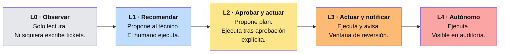

# 04 · Seguridad y modelo de autonomía

Un agente con credenciales sobre la infraestructura de un cliente es, por construcción,
la pieza de software más peligrosa que ese cliente va a instalar. Este documento define
cómo se acota ese riesgo.

Referencia normativa: **OWASP Top 10 for Agentic Applications 2026** (publicado
2025-12-09), que cataloga diez categorías de riesgo — ASI01 a ASI10 — específicas de
sistemas autónomos que planifican, mantienen memoria, invocan herramientas y actúan con
autoridad delegada.

---

## Principio rector: **mínima agencia**

OWASP lo llama *Least Agency*: la autonomía no es una propiedad por defecto, es un
privilegio que se gana. No se trata solo de a qué puede acceder el agente, sino de
cuánta libertad tiene para actuar sobre ese acceso sin consultar.



### El nivel efectivo es el mínimo de cuatro dimensiones

```
nivel_efectivo = min(
    nivel_base_de_la_acción,      # del catálogo de acciones
    techo_del_tenant,             # el cliente fija su tolerancia global
    techo_por_criticidad_del_CI,  # un DC de producción baja el techo
    techo_por_ventana_horaria     # fuera de horario baja el techo
)
```

Ejemplo: `reiniciar_servicio` tiene nivel base L3. Sobre un CI marcado como *crítico*,
el techo por criticidad es L2. Fuera de la ventana de mantenimiento, el techo horario es
L1. Resultado: **L1** — el agente recomienda y no toca nada.

### Promoción por evidencia (autonomía ganada)

Una acción sube de nivel solo cuando acumula evidencia, y solo por decisión explícita:

| Transición | Requisito |
|---|---|
| L1 → L2 | ≥ 20 propuestas, ≥ 90% aceptadas por el técnico sin modificar |
| L2 → L3 | ≥ 50 ejecuciones aprobadas, 0 reversiones, 0 incidentes derivados, ≥ 60 días |
| L3 → L4 | ≥ 200 ejecuciones, 0 reversiones, ≥ 180 días, **y aprobación escrita del cliente** |

Cualquier reversión, incidente derivado o rechazo del técnico **degrada la acción un
nivel de inmediato** y reinicia el contador. La degradación es automática; la promoción
nunca lo es.

### Techos duros — acciones que nunca superan L2

Sin importar la evidencia acumulada:

- Cualquier cosa que **otorgue o amplíe acceso** (permisos, grupos, membresías, roles)
- Cualquier cosa que **destruya datos** sin reversión verificada (borrado, formateo, purga)
- Cualquier cosa sobre un **controlador de dominio**, el firewall perimetral o el sistema de backup
- Cualquier cosa que **modifique la configuración del propio iTier** o de sus políticas
- Cualquier cosa con **impacto financiero** (compras, renovaciones, altas de licencia)

---

## Modelo de amenazas contra ASI Top 10

| ID | Riesgo | Cómo se mitiga en iTier |
|---|---|---|
| **ASI01** | **Agent Goal Hijack** — manipulación de los objetivos del agente vía prompts, documentos envenenados, salidas de herramientas engañosas o datos externos corrompidos | Todo texto que provenga del entorno del cliente (logs, descripciones de tickets, contenido de archivos, nombres de CI, salidas de comandos) se trata como **dato no confiable**, envuelto en delimitadores y nunca como instrucción. El agente no puede alterar su propia política ni sus propias herramientas. Las instrucciones operativas viajan por el canal de sistema, no por el contenido |
| **ASI02** | **Tool Misuse and Exploitation** — uso indebido de herramientas por un agente comprometido | Superficie MCP cerrada y tipada: sin `run_shell`, sin `execute_sql`, sin HTTP genérico. Cada tool valida sus parámetros con esquema estricto. Los playbooks son de un catálogo firmado; el agente elige por nombre, no compone comandos |
| **ASI03** | **Identity and Privilege Abuse** | Credenciales de menor privilegio por tipo de acción, no una cuenta única de administrador. Rotación automática. El agente **nunca** ve una credencial: los ejecutores las inyectan del vault en el momento de correr |
| **ASI04** | **Agentic Supply Chain Vulnerabilities** | Playbooks y actualizaciones firmados y verificados en el borde. Imágenes de contenedor con digest fijo y SBOM. Los servidores MCP son propios, no de terceros. Sin instalación de dependencias en tiempo de ejecución |
| **ASI05** | **Unexpected Code Execution (RCE)** | No existe una vía para que el modelo emita código ejecutable. Ansible corre playbooks del catálogo con parámetros tipados y validados contra esquema antes de la ejecución |
| **ASI06** | **Memory & Context Poisoning** | La memoria del agente (KB, historial de resoluciones) es de **solo lectura** en el bucle. Escribir en la KB es una propuesta que requiere revisión humana. La memoria está aislada por tenant, sin contaminación cruzada |
| **ASI07** | **Insecure Inter-Agent Communication** | Fase 1: no hay multi-agente. Cuando se introduzca A2A (fase 3), se exige Signed Agent Card y mTLS |
| **ASI08** | **Cascading Failures** | Cortacircuitos: tope de acciones por ventana temporal, por CI y por tenant. Una segunda falla del mismo playbook lo deshabilita automáticamente. Radio de explosión acotado: una ejecución nunca alcanza más de N CIs sin aprobación |
| **ASI09** | **Human-Agent Trust Exploitation** | Las propuestas al humano muestran **evidencia, no conclusiones**: qué se consultó, qué se encontró, qué se infirió y cuál es el nivel de confianza. La UI de aprobación distingue visualmente hecho verificado de inferencia del modelo |
| **ASI10** | **Rogue Agents** | Identidad criptográfica por appliance. Auditoría append-only con encadenamiento de hash, duplicada al plano de control en tiempo casi real. Un appliance que deja de reportar se aísla. Kill-switch remoto que desactiva toda la clase `act` |

---

## Postura de seguridad del appliance

| Superficie | Control |
|---|---|
| **Red** | Cero puertos entrantes. Solo túnel saliente mTLS. Firewall local con default-deny en egress, allowlist explícita |
| **SO** | Distribución mínima, arranque verificado, disco cifrado (LUKS), actualizaciones automáticas firmadas, línea base CIS |
| **Contenedores** | Sin root, rootfs de solo lectura, capabilities descartadas, límites de recursos, sin socket de Docker montado |
| **Secretos** | Vault local sellado con TPM. El agente jamás recibe un secreto: los ejecutores los inyectan en el momento y los descartan |
| **Credenciales del cliente** | Cuentas de servicio dedicadas por tipo de acción, con el mínimo privilegio necesario. Documentadas y auditables por el cliente |
| **Clave de la API de Claude** | **No está en el appliance.** Vive en el gateway del plano de control. El appliance se autentica con su certificado y el gateway hace la llamada |
| **Auditoría** | Append-only, cada entrada encadenada por hash a la anterior. Verificable e imposible de reescribir sin detección |
| **Aislamiento entre tenants** | Un appliance = un cliente. Sin memoria compartida, sin contexto compartido, sin credenciales compartidas |

---

## Qué se registra en cada decisión

Toda entrada de auditoría es autocontenida y responde a: *¿por qué el agente hizo esto?*

```json
{
  "decision_id": "dec_01J8X...",
  "ts": "2026-08-10T14:32:11Z",
  "tenant": "acme-sa",
  "trigger": { "type": "event", "source": "zabbix", "ref": "evt_88213" },
  "ci": { "id": "ci_4471", "name": "SRV-FILE01", "criticality": "alta" },
  "evidence": [
    { "tool": "metrics.query", "args": {...}, "digest": "sha256:..." },
    { "tool": "tickets.get_similar", "args": {...}, "digest": "sha256:..." }
  ],
  "reasoning_summary": "Uso de disco 92%. Tres incidentes previos idénticos, todos resueltos con limpieza de temporales. Sin crecimiento anómalo en logs de aplicación.",
  "proposed_action": { "playbook": "limpiar_temp_windows", "params": {...} },
  "policy": {
    "base_level": "L3", "tenant_ceiling": "L3",
    "ci_ceiling": "L2", "time_ceiling": "L3",
    "effective_level": "L2", "outcome": "requiere_aprobacion"
  },
  "approval": { "by": "tecnico@proveedor.com", "at": "2026-08-10T14:41:02Z" },
  "execution": { "status": "ok", "duration_s": 34, "rollback_available": true },
  "verification": { "symptom_cleared": true, "checked_at": "2026-08-10T14:46:00Z" },
  "model": { "id": "claude-opus-5", "input_tokens": 18432, "output_tokens": 1204 },
  "prev_hash": "sha256:...", "hash": "sha256:..."
}
```

---

## Lo que el cliente puede ver y controlar

La confianza se construye con transparencia operativa, no con promesas:

1. **Panel de autonomía** — qué puede hacer el agente hoy, en qué nivel, sobre qué CIs.
2. **Bitácora legible** — toda acción de los últimos 90 días, en lenguaje llano, exportable.
3. **Freno de mano** — el cliente puede bajar el techo de autonomía global a L1 en un clic,
   sin llamar a soporte.
4. **Ventanas de mantenimiento** — el cliente define cuándo el agente puede actuar.
5. **Lista de CIs intocables** — CIs marcados por el cliente donde el agente es L0
   permanente, sin excepción.

---

## Cumplimiento y normativa argentina

| Marco | Consideración |
|---|---|
| **Ley 25.326 de Protección de Datos Personales** | El diseño on-prem mantiene los datos personales dentro de la infraestructura del responsable. La minimización previa a la llamada al LLM y la redacción de PII acotan la transferencia internacional a lo estrictamente necesario para la operación |
| **Transferencia internacional** | Se documenta qué categorías de dato pueden salir en el contexto del LLM, con la política de redacción como control técnico y el DPA de Anthropic como control contractual |
| **Retención de datos** | Configurable por tenant. La auditoría tiene retención mínima obligatoria de 12 meses |
| **Contrato con el cliente** | Debe explicitar: qué modelo se usa, qué categorías de dato salen, dónde vive la auditoría y cómo se ejerce el derecho de acceso y supresión |

> ⚠️ Este cuadro es orientativo de diseño técnico, no asesoramiento legal.
> El contrato y el aviso de privacidad deben revisarse con un profesional antes de
> firmar el primer cliente.

---

## Fuentes

- [OWASP Top 10 for Agentic Applications 2026 — OWASP Gen AI Security Project](https://genai.owasp.org/resource/owasp-top-10-for-agentic-applications-for-2026/)
- [OWASP Top 10 for Agentic Applications — Explained (Giskard)](https://www.giskard.ai/knowledge/owasp-top-10-for-agentic-application-2026)
- [OWASP ASI01: Agent Goal Hijack — Adversa AI](https://adversa.ai/blog/asi01-agent-goal-hijack-a-practical-security-guide/)
- [OWASP Top 10 for Agentic Applications 2026 Is Here — Palo Alto Networks](https://www.paloaltonetworks.com/blog/cloud-security/owasp-agentic-ai-security/)
- [Agentic Security Initiative — OWASP Gen AI Security Project](https://genai.owasp.org/initiatives/agentic-security-initiative/)
