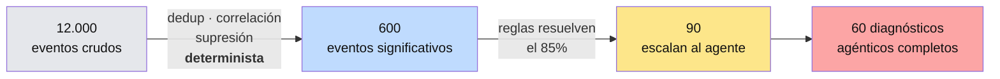

# 05 · Modelo de costos y economía unitaria

Todos los precios de API son los vigentes al 2026-08-10 y están en USD.

> ⚠️ Los volúmenes de este modelo son **estimaciones de diseño**, no mediciones.
> El primer piloto debe instrumentarse para reemplazarlas con datos reales antes de
> fijar precio de lista. Ver [criterios de salida de Fase 1](06-roadmap.md).

---

## 1. Precios de referencia de la API

| Modelo | ID | Contexto | Input / MTok | Output / MTok |
|---|---|---|---|---|
| Claude Opus 5 | `claude-opus-5` | 1M | $5.00 | $25.00 |
| Claude Sonnet 5 | `claude-sonnet-5` | 1M | $3.00 | $15.00 |
| Claude Haiku 4.5 | `claude-haiku-4-5` | 200K | $1.00 | $5.00 |

**Modificadores que aplicamos:**

| Mecanismo | Efecto | Uso en iTier |
|---|---|---|
| **Prompt caching — lectura** | ~0.1× el precio de input | El prefijo (system prompt + definiciones de tools) se cachea. Es el ahorro más grande del diseño |
| **Prompt caching — escritura** | 1.25× (TTL 5 min) · 2× (TTL 1 h) | TTL de 5 min por defecto; 1 h solo en horarios de alta actividad |
| **Batch API** | 50% de descuento | Trabajo no interactivo: reportes mensuales, normalización de inventario, análisis de tendencias |

**Nota sobre el prefijo cacheado:** el mínimo cacheable de `claude-opus-5` es de 512
tokens (la mitad que en Opus 4.8), lo que permite cachear incluso prompts de
herramientas acotados. El prefijo debe mantenerse **byte-idéntico**: nada de timestamps,
nada de IDs de sesión, nada de nombres de cliente en el system prompt. Todo lo variable
va después del último punto de caché.

---

## 2. Escenario base: PyME de 40 dispositivos

### Volúmenes mensuales estimados



| Tipo de interacción | Volumen/mes | Turnos por interacción |
|---|---:|---:|
| Triage escalado | 90 | 1 |
| Diagnóstico agéntico completo | 60 | ~8 |
| Conversación de service desk (WhatsApp) | 50 | ~6 |
| Solicitud de servicio | 25 | ~5 |
| RCA profundo (Problem Management) | 4 | ~25 |
| Reporte ejecutivo mensual | 1 | ~15 |

### Consumo de tokens estimado

| Interacción | Input nuevo | Lectura de caché | Output |
|---|---:|---:|---:|
| Triage (90×) | 450 K | 720 K | 54 K |
| Diagnóstico (60×) | 1.200 K | 4.200 K | 300 K |
| Service desk (50×) | 600 K | 1.400 K | 125 K |
| Solicitudes (25×) | 250 K | 625 K | 50 K |
| RCA (4×) | 600 K | 1.000 K | 60 K |
| Reporte (1×) | 100 K | 100 K | 10 K |
| **Total** | **3,20 M** | **8,05 M** | **0,60 M** |
| Escrituras de caché | | **~1,20 M** | |

### Costo mensual — todo en `claude-opus-5` (default)

| Concepto | Tokens | Precio efectivo | Costo |
|---|---:|---:|---:|
| Input nuevo | 3,20 M | $5,00 | $16,00 |
| Lectura de caché | 8,05 M | $0,50 | $4,03 |
| Escritura de caché | 1,20 M | $6,25 | $7,50 |
| Output | 0,60 M | $25,00 | $14,98 |
| | | **Total** | **≈ $42,50** |

### Costo mensual — con ruteo por niveles (opt-in)

Haiku 4.5 para triage · Sonnet 5 para service desk y solicitudes · Opus 5 para
diagnóstico, RCA y reportes:

| Bloque | Modelo | Costo |
|---|---|---:|
| Triage | `claude-haiku-4-5` | $0,79 |
| Service desk | `claude-sonnet-5` | $4,10 |
| Solicitudes | `claude-sonnet-5` | $1,69 |
| Diagnóstico | `claude-opus-5` | $15,60 |
| RCA | `claude-opus-5` | $5,00 |
| Reportes | `claude-opus-5` | $0,80 |
| Escrituras de caché | mixto | ~$4,00 |
| | **Total** | **≈ $32,00** |

> **Conclusión importante:** el ruteo por niveles ahorra apenas **~25% (USD 10/mes)**,
> porque el 60% del costo está en el bucle de diagnóstico — que es exactamente donde
> **no** conviene bajar de modelo. Con esa magnitud de ahorro, **el default debe ser
> `claude-opus-5` en todo el bucle.** El ruteo se evalúa recién cuando haya datos de
> calidad medida por bloque, no antes.

---

## 3. Economía unitaria completa

### Costo directo por cliente / mes

| Concepto | Costo |
|---|---:|
| API de Claude (`claude-opus-5`) | $42,50 |
| Hardware amortizado (mini-PC $200 ÷ 36 meses) | $5,60 |
| Plano de control prorrateado (infra ~$300/mes ÷ 50 clientes) | $6,00 |
| Conectividad y almacenamiento de auditoría | $2,00 |
| **Costo directo de plataforma** | **≈ $56,10** |

No incluye tiempo de técnico humano, que es el costo dominante del servicio y el que
la automatización busca reducir.

### Sensibilidad al tamaño del cliente

| Dispositivos | API/mes | Costo directo/mes |
|---:|---:|---:|
| 10 | ~$14 | ~$28 |
| 40 | ~$43 | ~$56 |
| 100 | ~$95 | ~$110 |
| 250 | ~$210 | ~$230 |

El costo de API escala aproximadamente lineal con el volumen de eventos, que escala
sublinealmente con el número de dispositivos (más dispositivos ≠ proporcionalmente más
incidentes; hay economías de correlación).

---

## 4. Pricing sugerido

Cobrar **por dispositivo gestionado**, no por técnico. Es el eje correcto para PyME y el
que diferencia frente a ServiceNow, JSM y Freshservice, que cobran por asiento.

| Plan | Autonomía máxima | Precio / dispositivo / mes |
|---|---|---:|
| **Visibilidad** | L0–L1 · inventario, monitoreo, recomendaciones | $5 |
| **Gestionado** ⭐ | hasta L3 · remediación automática con notificación | $9 |
| **Autónomo** | hasta L4 · con SLA y reporte ejecutivo | $14 |

Mínimo facturable: 10 dispositivos.

### Margen bruto — cliente de 40 dispositivos, plan Gestionado

```
Ingreso:        40 × $9   = $360,00 / mes
Costo directo:              $56,10 / mes
Margen bruto:               $303,90 / mes  (84%)
```

El 84% de margen bruto es lo que financia el tiempo del técnico humano, la venta y el
desarrollo. **La palanca del negocio no es el precio: es cuántas horas de técnico
elimina la automatización por cliente.**

---

## 5. Controles de costo obligatorios

Un agente en bucle puede quemar presupuesto silenciosamente. Estos controles no son
opcionales:

| Control | Implementación |
|---|---|
| **Tope duro de gasto por tenant** | El gateway de LLM corta al alcanzar el tope mensual configurado. El agente degrada a L0 (observar) y notifica; no falla silenciosamente |
| **Presupuesto de tarea** | `output_config.task_budget` en bucles agénticos, para que el modelo se autorregule y cierre ordenadamente en vez de ser cortado |
| **Tope de iteraciones** | Máximo de turnos por interacción en el tool runner |
| **Contabilidad por decisión** | Cada entrada de auditoría lleva sus tokens y su costo. Se puede responder "cuánto costó resolver este incidente" |
| **Cortacircuito de bucle** | Detección de bucles improductivos: si el agente repite la misma tool con los mismos argumentos, se aborta y escala a humano |
| **Reglas primero** | El control de costo más efectivo del diseño: cada evento resuelto por una regla determinista es un evento que no cuesta tokens. **Subir la tasa de resolución por reglas del 85% al 92% ahorra más que cambiar de modelo** |
| **Batch para lo no interactivo** | Reportes y análisis de tendencia por Batch API: 50% de descuento |

### Higiene de caché de prompts

El caché es prefix-match: **cualquier byte que cambie invalida todo lo que viene después.**
Auditar que no haya en el prefijo:

- `datetime.now()` o timestamps
- UUIDs o IDs de request/sesión
- nombre del tenant o del cliente
- serialización de diccionarios sin orden determinista
- conjunto de tools variable por cliente

Verificación: `usage.cache_read_input_tokens` debe ser consistentemente > 0 en
peticiones sucesivas. Si da cero, hay un invalidador silencioso.

---

## 6. Qué medir en el piloto

Antes de publicar precio de lista, el piloto debe producir:

| Métrica | Por qué importa |
|---|---|
| Eventos crudos → eventos significativos | Valida el supuesto de reducción determinista |
| % resuelto por reglas vs. escalado al agente | Driver #1 del costo |
| Tokens reales por tipo de interacción | Reemplaza las estimaciones de este documento |
| Tasa efectiva de acierto de caché | Valida el ahorro de ~0.1× |
| Horas de técnico ahorradas por cliente/mes | Driver #1 del **precio** |
| Tasa de aceptación de propuestas (L1/L2) | Insumo de la promoción de autonomía |
| Tasa de reversión | Métrica de seguridad; debe tender a cero |
