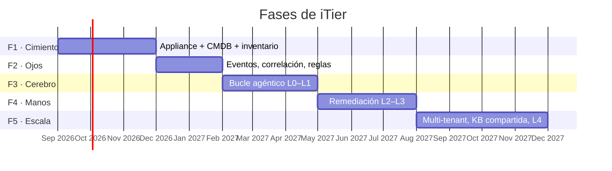

# 06 · Roadmap

Cinco fases. Cada una con un criterio de salida verificable — no se avanza sin cumplirlo.

---

## Fase 1 · Cimiento (≈3 meses)

**Sin CMDB confiable no hay agente que valga.** Esta fase no tiene IA y es la más
importante.

**Alcance**
- Appliance empaquetado: mini-PC con imagen reproducible, arranque verificado, disco cifrado
- Enrolamiento y túnel mTLS saliente contra el plano de control
- GLPI 11 + PostgreSQL desplegados y hardened
- GLPI Agent: inventario de endpoints y descubrimiento SNMP de red
- Inventario remoto sin agente (WinRM/SSH) para servidores
- Plano de control mínimo: registro de appliances, salud de flota, actualizaciones firmadas
- Auditoría append-only con encadenamiento de hash

**Criterio de salida**
- 3 clientes piloto con appliance instalado
- ≥ 95% de los dispositivos de red descubiertos y clasificados correctamente
- Grafo de CMDB con relaciones verificadas manualmente en al menos 1 cliente
- Un appliance sobrevive 30 días sin intervención manual
- Corte de internet de 24 h: cero pérdida de datos de inventario

---

## Fase 2 · Ojos (≈2 meses)

**Alcance**
- Zabbix Proxy integrado, templates para el stack típico PyME (Windows Server, AD, NAS,
  firewall, UPS, hipervisor)
- Motor de reglas determinista: deduplicación, correlación, supresión, enriquecimiento con CMDB
- Catálogo inicial de ~40 reglas de detección
- Panel de eventos y alertas en el plano de control
- Notificaciones por WhatsApp / Teams / email

**Criterio de salida**
- Reducción de eventos crudos a significativos ≥ 95%
- ≥ 85% de los eventos significativos resueltos o clasificados por regla, sin LLM
- Cero falsos negativos en los 10 escenarios críticos definidos (disco lleno, backup
  fallido, DC caído, certificado vencido, enlace caído, UPS en batería, RAID degradado,
  servicio detenido, AD sin replicar, espacio de buzón agotado)

**Este es el punto de corte comercial.** Con Fases 1 y 2 ya hay un producto vendible
(plan Visibilidad, USD 5/dispositivo). Si el mercado no valida acá, no tiene sentido
seguir.

---

## Fase 3 · Cerebro — L0 a L1 (≈3 meses)

El agente entra, pero **no toca nada**. Solo observa y recomienda.

**Alcance**
- Gateway MCP con la clase `read` completa
- Bucle del agente con el tool runner del SDK de Anthropic
- Motor de políticas con niveles L0–L1
- Diagnóstico de primera línea, correlación y análisis de causa raíz
- Redacción de tickets y comunicaciones
- Clase `write_itsm` (tickets y propuestas de KB)
- Contabilidad de tokens y costo por decisión
- UI de propuestas que separa visualmente **evidencia verificada** de **inferencia del modelo**

**Criterio de salida**
- ≥ 80% de las recomendaciones calificadas como "correctas y accionables" por el técnico
- Costo real de API dentro del ±30% del modelo estimado
- Tasa de acierto de caché de prompts ≥ 70%
- Cero incidentes de fuga de PII en la capa de minimización (auditoría de muestra)
- Tiempo medio de diagnóstico reducido ≥ 40% respecto de la línea base de Fase 2

---

## Fase 4 · Manos — L2 a L3 (≈3 meses)

**Alcance**
- Ansible con catálogo inicial de ~30 playbooks firmados, todos con reversión
- Clase `act` en el gateway MCP y `remediate.dry_run` siempre disponible
- Cola de aprobaciones en el plano de control, con notificación push y móvil
- Motor de promoción por evidencia (L1→L2→L3) con degradación automática
- Verificación post-remediación y reversión automática ante falla
- Cortacircuitos: tope por ventana, radio de explosión, deshabilitado tras segunda falla
- Freno de mano y lista de CIs intocables, en manos del cliente

**Criterio de salida**
- ≥ 300 remediaciones ejecutadas en producción
- Tasa de reversión < 2%
- **Cero** incidentes causados por el agente
- ≥ 90% de las propuestas L2 aprobadas sin modificación
- Ahorro medible de horas-técnico por cliente ≥ 30%
- Auditoría verificada de forma independiente en al menos 1 cliente

---

## Fase 5 · Escala (≈4 meses)

**Alcance**
- Multi-tenant maduro: 50+ appliances con operación centralizada
- KB compartida entre clientes con anonimización verificada
- Nivel L4 habilitado para acciones con historial probado
- Solicitudes de servicio: onboarding y offboarding automatizados
- Change Enablement con evaluación de riesgo
- Reporte ejecutivo mensual automático
- Panel de autonomía y bitácora legible para el cliente final
- Perfil sonda (Raspberry Pi) para sucursales

**Criterio de salida**
- 50 clientes en producción
- Ratio técnico:cliente ≥ 1:25
- Margen bruto ≥ 80% sostenido
- NPS del cliente final ≥ 50

---

## Más allá (fase 6+)

| Iniciativa | Motivo |
|---|---|
| **A2A** (Agent2Agent) | Que el agente de iTier negocie con agentes de proveedores: ISP, fabricante de hardware, otro MSP. El estándar ya está en Linux Foundation con spec 1.0 y Signed Agent Cards |
| **Service Level Management** | Cuando los clientes tengan SLAs formales que gestionar |
| **Capacity & Performance** | Requiere 6+ meses de series históricas por cliente |
| **Modelo local para pre-filtrado** | Reevaluar solo si el hardware de borde mejora sustancialmente. Hoy no cierra: un Pi 5 hace 5–15 tok/s en modelos de 1,5 B, insuficiente para un bucle con herramientas |
| **Certificación ISO/IEC 20000** | Cuando haya un cliente que la exija y justifique el costo |

---

## Riesgos y mitigaciones

| Riesgo | Impacto | Mitigación |
|---|---|---|
| El agente causa un incidente en producción | Existencial para la confianza | Autonomía graduada, reversión obligatoria, cortacircuitos, techos duros. La Fase 4 no arranca sin la Fase 3 validada |
| El costo de API se dispara con un cliente ruidoso | Margen | Tope duro por tenant en el gateway; reglas deterministas como primera línea |
| CMDB de baja calidad envenena todo el razonamiento | Producto inútil | Fase 1 completa antes de cualquier IA. Validación manual del grafo en el piloto |
| Dependencia de un único proveedor de LLM | Estratégico | La superficie MCP y el motor de políticas son agnósticos del modelo. El acoplamiento está confinado al gateway del plano de control |
| GLPI cambia de rumbo o de licencia | Alto | La CMDB se accede vía la capa MCP, no directamente. Sustituir el núcleo ITSM afecta un adaptador, no el agente |
| El cliente no confía en la automatización | Comercial | Los planes están alineados a niveles de autonomía: el cliente compra la confianza que quiere, y la sube cuando la ve funcionar |
